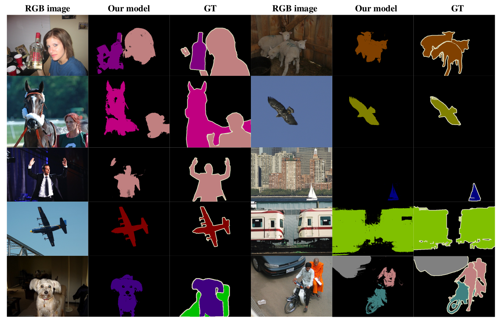

# Learning to Exploit the Prior Network Knowledge for Weakly-Supervised Semantic Segmentation

By Carolina Redondo-Cabrera, Marcos Baptista-Ríos and Roberto J. López-Sastre.

This is a repository with the original implementation of the weakly-supervised semantic segmentation method detailed in our [IEEE TIP journal paper](https://arxiv.org/abs/1804.04882). 


<div align="center">
  
  <p>Example of our semantic segmentation results.</p>
</div>


### License

This repository is released under the GNU General Public License v3.0 License (refer to the LICENSE file for details).

### Citing

If you make use of this data and software, please cite the following references in any publications:

	@Article{Redondo-Cabrera2019,
	author 	= {Redondo-Cabrera, C. and Baptista-R\'ios, M. and L\'opez-Sastre, R.~J.},
	title   = {Learning to Exploit the Prior Network Knowledge for Weakly-Supervised Semantic Segmentation},
	journal = {IEEE Transactions on Image Processing},
	year    = {2019},
	}

	@article{Deeplab,
  	title={DeepLab: Semantic Image Segmentation with Deep Convolutional Nets, Atrous Convolution, and Fully Connected CRFs},
	  author={Liang-Chieh Chen and George Papandreou and Iasonas Kokkinos and Kevin Murphy and Alan L Yuille},
	  journal={IEEE Transactions on Pattern Analysis and Machine Intelligence},
	  year={2018}
	}


## Contents
1. [Requirements: software](#requirements-software)
2. [Requirements: hardware](#requirements-hardware)
3. [Installation](#installation)
4. [Pre-trained models](#download-pre-trained-models)
5. [Usage](#usage)

## Requirements: software

1. Requirements for `Caffe` and `pycaffe` (see: [Caffe installation instructions](http://caffe.berkeleyvision.org/installation.html))
2. Matlab 2015 (or higher)
3. A copy of the [PASCAL VOC 2012 Development Kit](http://host.robots.ox.ac.uk/pascal/VOC/voc2012/VOCdevkit_18-May-2011.tar)

This project has been developed and tested under Ubuntu 14.04 and Ubuntu 16.04.


## Requirements: hardware

1. It is required a GPU with at least 11 GB of memory and CUDA support. We have used an NVIDIA Titan and an NVIDIA Geforce 1080 Ti.


## Usage

Step 1:  Clone the repository

  ```Shell
  git clone https://github.com/gramuah/weakly-supervised-segmentation.git
  ```

Step 2: We'll call the directory that you cloned `PROJECT_ROOT`

 
Step 3: Build the Caffe distribution we provide.


    ```Shell
    cd $PROJECT_ROOT/caffe
    # Now follow the Caffe installation instructions here:
    #   http://caffe.berkeleyvision.org/installation.html

    # If you're experienced with Caffe and have all of the requirements installed
    # and your Makefile.config in place, then simply do:
    make -j8 && make pycaffe

    ```

Step 4: Run the following script to generate the pre-trained models provided

```Shell
cd $PROJECT_ROOT/caffe
generate_caffe_models.sh
```
Check that the models downloaded have the correct MD5 signature.

Step 5: You are ready to run the following script to generate the semantic segmentation.

```Shell
cd $PROJECT_ROOT/caffe
python run_semantic_segmentation.py
```

Note that we provide 2 examples images in folder:

```Shell
$PROJECT_ROOT/datasets/benchmark_RELEASE/dataset/JPEGImages/
```

You can add more images to this directory. If so, remember to also update the files:
caffe/voc12_weakly/list/val.txt
caffe/voc12_weakly/list/val_id.txt

Output is written in `$PROJECT_ROOT/voc12_weakly/res/`.

Enjoy.

